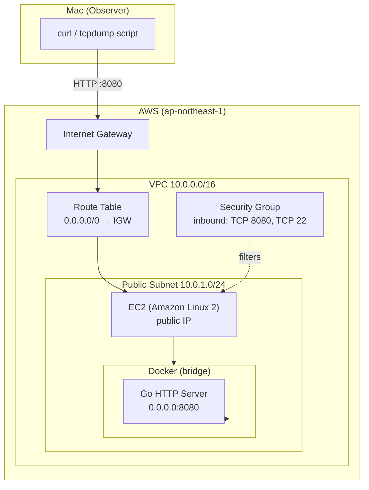
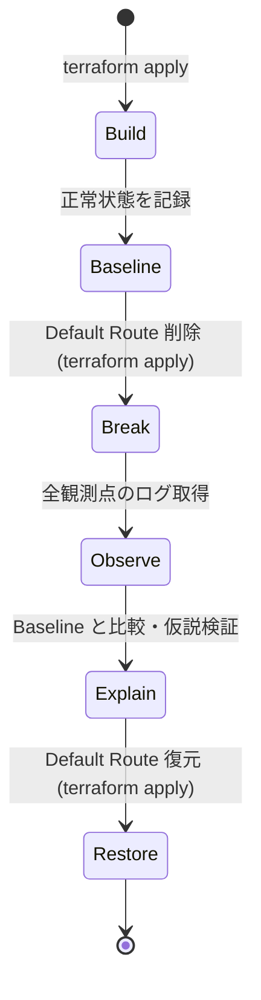
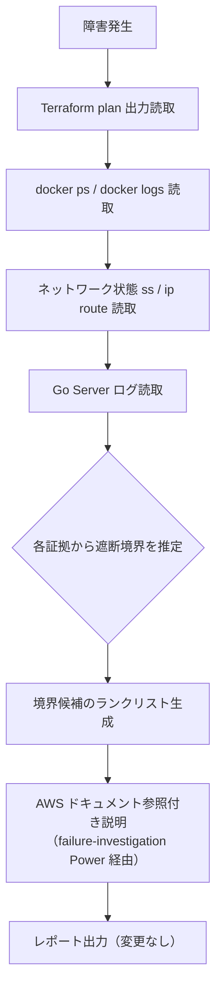

# Design Document

## Overview

本システムは、AWS上にTerraform + EC2 + Docker + Goで構成されたネットワーク障害観測実験システムである。実験フロー **Hypothesis → Build → Baseline → Break → Observe → Explain → Restore** に従い、Public SubnetのRoute Tableからデフォルトルートを削除したとき通信がどの境界で遮断されるかを精密に観測する。

各HTTPリクエストにTrace ID（UUID v4形式）を付与し、Mac・EC2・Docker・Goアプリの全観測点にわたってログを横断的に紐付ける。実験結果はBaselineとの比較レポートとして保存する。

本設計は Experiment 1「Route Table の default route を削除する」を主たる対象とするが、将来の Experiment 2・3（Docker port mapping 削除、Go bind アドレス変更）へ拡張可能な構造とする。

### システム全体のパケット経路（正常時）

```
Mac
 │  curl http://<public-ip>:8080/health  -H "X-Trace-ID: <uuid>"
 ↓
Internet
 ↓
Internet Gateway (IGW)
 ↓
Route Table: 0.0.0.0/0 → IGW
 ↓
EC2 (Amazon Linux 2, public IP)
 ↓  port 8080
Docker (bridge network, -p 8080:8080)
 ↓  container port 8080
Go HTTP Server (0.0.0.0:8080)
```

---

## Architecture

### コンポーネント構成図



### 実験状態遷移



---

## Components and Interfaces

### 1. Terraform Infrastructure Layer

**ファイル構成:**

```
infra/
├── main.tf          # VPC, Subnet, IGW, Route Table, Security Group, EC2
├── variables.tf     # region, ami_id, instance_type, key_name
├── outputs.tf       # ec2_public_ip, instance_id
└── terraform.tfvars # 実環境値（gitignore対象）
```

**リソース一覧:**

| リソース型 | 論理名 | 役割 |
|---|---|---|
| `aws_vpc` | `main` | 実験用 VPC (10.0.0.0/16) |
| `aws_subnet` | `public` | Public Subnet (10.0.1.0/24) |
| `aws_internet_gateway` | `main` | IGW |
| `aws_route_table` | `public` | ルートテーブル本体 |
| `aws_route` | `default` | `0.0.0.0/0 → IGW`（実験対象） |
| `aws_route_table_association` | `public` | Subnet ↔ Route Table 紐付け |
| `aws_security_group` | `ec2` | inbound: TCP 22, TCP 8080 |
| `aws_instance` | `experiment` | Amazon Linux 2, t3.micro |

> **設計決定**: `aws_route` を `aws_route_table` の `route` ブロックではなく、独立リソースとして管理する。これにより Experiment 1 の障害注入は「`aws_route.default` リソースをコメントアウトして `terraform apply`」という最小変更で実現できる。

**Outputs:**

```hcl
output "ec2_public_ip" {
  value = aws_instance.experiment.public_ip
}
output "instance_id" {
  value = aws_instance.experiment.id
}
```

---

### 2. Go HTTP Server

**ファイル構成:**

```
app/
├── main.go           # HTTPサーバー本体
├── handler.go        # /health ハンドラー、Trace ID ミドルウェア
├── trace.go          # Trace ID 生成・バリデーション
├── logger.go         # 構造化ログ（JSON形式）
├── main_test.go      # ユニットテスト・プロパティテスト
└── Dockerfile        # マルチステージビルド
```

**エンドポイント:**

| Method | Path | 正常レスポンス |
|---|---|---|
| `GET` | `/health` | `200 OK`, body: `{"status":"ok","trace_id":"<id>"}` |

**Trace ID ミドルウェア（処理フロー）:**

```mermaid
flowchart TD
    A[リクエスト受信] --> B{X-Trace-ID ヘッダーあり?}
    B -->|Yes| C{フォーマット検証\n/^[A-Za-z0-9\-_]{1,64}$/}
    B -->|No| D[UUID v4 を生成]
    C -->|OK| E[Trace ID 確定]
    C -->|NG| F[400 Bad Request\ndescriptive error body]
    D --> E
    E --> G[リクエストログ出力\nJSON形式]
    G --> H[ハンドラー処理]
    H --> I[レスポンスに X-Trace-ID セット]
```

**構造化ログフォーマット（JSON）:**

```json
{
  "timestamp": "2025-01-15T10:30:00.123Z",
  "trace_id": "550e8400-e29b-41d4-a716-446655440000",
  "method": "GET",
  "path": "/health",
  "status": 200,
  "duration_ms": 1
}
```

> **tcpdump との相関について:** tcpdump は L4（TCP）レベルのキャプチャのため、HTTPヘッダー `X-Trace-ID` を直接参照できない。tcpdump ログと Go Server ログの相関は **タイムスタンプ・送信元IPアドレス・宛先ポート（8080）** を照合して行う。Trace ID はアプリケーション層（Go Server ログ・curl 出力）のみで確認可能。

---

### 3. Docker コンテナ設定

**Dockerfile（マルチステージ）:**

```
Stage 1: golang:1.22-alpine  → go build
Stage 2: alpine:3.19         → 実行バイナリのみコピー
```

**起動コマンド（EC2 上での実行）:**

```bash
docker run -d \
  --name go-server \
  --restart unless-stopped \
  -p 8080:8080 \
  go-http-server:latest
```

> **設計決定**: `--restart unless-stopped` によりEC2再起動後も自動起動。Experiment 2（port mapping 削除実験）では `-p 8080:8080` を取り除いて再起動することで障害を再現する。

---

### 4. Baseline / Observation スクリプト

**ファイル構成:**

```
scripts/
├── baseline.sh           # Baseline記録（全観測点・正常時）
├── pre-fault-monitor.sh  # 障害注入前にEC2でtcpdump + health監視をバックグラウンド起動
├── observe.sh            # 障害中観測（Macからの curl タイムアウト確認のみ）
├── post-restore-collect.sh # 復旧後にSSHでEC2に接続しtcpdump/healthログを回収
├── restore_check.sh      # 復旧確認（30秒以内にHTTP 200を確認）
└── compare.sh            # Baseline vs Observation 比較レポート生成
```

**実験フロー（SSH不可対応）:**

```
1. baseline.sh       → 正常状態の5観測点を baseline.json に記録
2. pre-fault-monitor.sh → EC2上でtcpdump (port 8080) + health定期チェックをバックグラウンド起動
                          ログは EC2 上の /tmp/tcpdump.log / /tmp/health.log に蓄積
3. [手動] terraform apply（aws_route.default を削除）
4. observe.sh        → MacからEC2:8080へ curl を実行し、タイムアウト/接続エラーを記録
                       ※ SSH不可のため EC2 への直接アクセスはここでは行わない
5. [手動] terraform apply（aws_route.default を復元）
6. restore_check.sh  → 30秒以内にHTTP 200受信を確認
7. post-restore-collect.sh → SSH回復後にEC2へ接続し /tmp/tcpdump.log と /tmp/health.log を回収
                              回収ログを results/fault.json に統合する
8. compare.sh        → baseline.json vs fault.json の比較レポートを results/report.md に生成
```

**baseline.sh が記録する観測点:**

| 観測点 | コマンド | 記録内容 |
|---|---|---|
| Mac curl | `curl -H "X-Trace-ID: <uuid>" http://<ip>:8080/health` | HTTPステータス・レスポンスヘッダー |
| EC2 tcpdump | `tcpdump -i eth0 'tcp port 8080' -c 20` | TCP SYN/SYN-ACK/ACK パケット |
| Docker状態 | `docker ps` | コンテナ Running 状態 |
| Host curl | `curl http://localhost:8080/health` | EC2ホストからのHTTPステータス |
| Go ログ | `docker logs go-server --tail 5` | Trace IDを含むログ行 |

> **tcpdump との相関:** baseline のtcpdump記録と Go Server ログは、**タイムスタンプ・送信元IPアドレス・宛先ポート8080** で照合する（L4キャプチャのため Trace ID による直接相関は不可）。

**pre-fault-monitor.sh の動作:**

- `ssh ec2-user@<EC2_IP>` で接続し、以下をバックグラウンドで起動して即切断する
- `sudo tcpdump -i eth0 'tcp port 8080' -w /tmp/tcpdump.pcap &` （バックグラウンド起動）
- `while true; do curl -s -o /dev/null -w "%{time_local} %{http_code}\n" http://localhost:8080/health >> /tmp/health.log; sleep 5; done &` （定期 health チェック）
- `while true; do docker ps --format "{{.Names}} {{.Status}}" >> /tmp/docker.log; sleep 5; done &` （定期 docker 状態チェック）
- tcpdump・healthチェック・dockerチェックの各PIDを `/tmp/monitor.pid` に保存する

**post-restore-collect.sh の動作:**

- `ssh ec2-user@<EC2_IP>` で接続し、バックグラウンドプロセスを停止する（`/tmp/monitor.pid` 参照）
- `/tmp/tcpdump.pcap` と `/tmp/health.log` と `/tmp/docker.log` を `scp` でローカルの `results/` にダウンロードする
- 回収データを `results/fault.json` の観測点として統合する

---

### 5. failure-investigation Power

**ファイル構成:**

```
.kiro/powers/failure-investigation/
├── plugin.json
├── mcp.json                        # AWS Documentation MCP
└── skills/
    └── investigate-network-failure/
        └── SKILL.md
```

**plugin.json の役割:** Power のメタデータ、依存MCP一覧、スキル一覧を定義する

**mcp.json の役割:** aws-docs MCPサーバー（`uvx awslabs.aws-documentation-mcp-server@latest`）を定義する

**SKILL.md の役割:** 障害調査スキルの手順を定義する
- フロー: Hypothesis（仮説参照）→ Observe（証拠収集）→ Evidence（証拠整理）→ Root Cause（根本原因特定）→ Verify（仮説との照合）

> **設計決定:** Power = 「再利用可能な専門能力のパッケージ」。スキルと外部ツール（MCP）を束ねる。他のエージェントや将来の実験でも再利用可能。

---

### 6. Incident Investigator Custom Agent

**エージェント定義ファイル:**

```
.kiro/agents/incident-investigator.md
```

**エージェントの役割:**
- failure-investigation Power の `investigate-network-failure` スキルを呼び出す
- AWS Documentation MCP（Power経由）を使ってネットワーク動作の根拠を補強する
- 読み取り専用制約を持つ（`terraform apply` / `terraform destroy` / Docker stop・rm / ファイル書き込みを実行しない）

> **設計決定:** Custom Agent = 「その能力を使う担当者」。Powerを呼び出すオーケストレーターとして振る舞い、読み取り専用・禁止操作などの制約を持つ。

**エージェントの動作仕様:**



**制約（読み取り専用）:**
- `terraform apply` / `terraform destroy` を実行しない
- Docker の stop / rm を実行しない
- ファイルの書き込みを行わない

---

### 7. Kiro Hook（自動検証）

**Hook定義ファイル:** `.kiro/hooks/auto-validate.json`

> **仕様注記:** 現行 Kiro の `PostTaskExec` トリガーはファイルパスの正規表現フィルタリング（matcher）をサポートしていない。そのため、タスク完了後の検証には `Stop`（Agent Stop）トリガーを使用する。`Stop` トリガーにも matcher は不要。Go/TF ファイルの存在確認はシェルスクリプト内の条件分岐で行う。

```json
{
  "version": "v1",
  "hooks": [
    {
      "name": "Validate on Agent Stop",
      "trigger": "Stop",
      "action": {
        "type": "command",
        "command": "if find app -name '*.go' -maxdepth 1 | grep -q .; then cd app && go test ./...; fi && if find infra -name '*.tf' -maxdepth 1 | grep -q .; then cd infra && terraform fmt -check && terraform validate; fi"
      }
    }
  ]
}
```

**シェルスクリプト内条件分岐の意図:**

| 条件 | 実行コマンド |
|---|---|
| `app/*.go` が存在する | `cd app && go test ./...` |
| `infra/*.tf` が存在する | `cd infra && terraform fmt -check && terraform validate` |
| どちらも存在しない | 何もしない（exit 0） |

---

## Data Models

### TraceID

```go
// trace.go
// Trace_ID の正規表現パターン: ^[A-Za-z0-9\-_]{1,64}$
// 有効: 1〜64 文字、[A-Za-z0-9\-_] のみ
// 無効: 65 文字以上、または [A-Za-z0-9\-_] 以外の文字を含む
type TraceID string

const (
    TraceIDMaxLen  = 64  // 最大文字数。65文字以上はすべて invalid
    TraceIDPattern = `^[A-Za-z0-9\-_]{1,64}$`
)

// Validate は TraceID の形式を検証する
// 有効（1〜64文字かつパターン一致）: true
// 無効（空文字、65文字以上、パターン外文字を含む）: false
func (t TraceID) Validate() bool

// NewTraceID は UUID v4 ベースの新しい TraceID を生成する
func NewTraceID() TraceID
```

### LogEntry

```go
// logger.go
type LogEntry struct {
    Timestamp  time.Time `json:"timestamp"`
    TraceID    TraceID   `json:"trace_id"`
    Method     string    `json:"method"`
    Path       string    `json:"path"`
    Status     int       `json:"status"`
    DurationMs int64     `json:"duration_ms"`
}
```

### BaselineRecord

```go
// Baseline記録の構造（JSONファイルとして保存）
type ObservationPoint struct {
    Name      string    `json:"name"`        // "mac_curl", "tcpdump", etc.
    Timestamp time.Time `json:"timestamp"`
    TraceID   string    `json:"trace_id"`
    Result    string    `json:"result"`      // raw output or status
    Success   bool      `json:"success"`
}

type ExperimentRecord struct {
    Phase       string             `json:"phase"`        // "baseline" | "fault"
    CapturedAt  time.Time          `json:"captured_at"`
    Points      []ObservationPoint `json:"points"`
}
```

**保存先:**

```
results/
├── baseline.json    # Baseline フェーズの観測結果
├── fault.json       # Break/Observe フェーズの観測結果
└── report.md        # 比較レポート（Hypothesis vs Actual）
```

### Terraform State 保存方針

本実験環境は単一Observer向けローカル実行を前提とするため、Terraform state はローカルファイル（`infra/terraform.tfstate`）に保存する。`.gitignore` で `*.tfstate*` を除外し、シークレット情報の漏洩を防ぐ。

---

## Correctness Properties

*A property is a characteristic or behavior that should hold true across all valid executions of a system — essentially, a formal statement about what the system should do. Properties serve as the bridge between human-readable specifications and machine-verifiable correctness guarantees.*

### Property 1: Trace ID ラウンドトリップ

*For any* 正規表現 `[A-Za-z0-9\-_]{1,64}` に合致するTrace ID値に対し、Go ServerへそのTrace IDをリクエストヘッダー `X-Trace-ID` に付与して送信したとき、レスポンスヘッダー `X-Trace-ID` に同一のTrace ID値が返される。

**Validates: Requirements 3.1, 3.4**

### Property 2: 不正 Trace ID の拒否

*For any* Trace ID 値が 65 文字以上、または `[A-Za-z0-9\-_]` 以外の文字を含む（有効範囲 `[A-Za-z0-9\-_]{1,64}` 外）場合に対し、Go Server は HTTP 400 を返し、レスポンスbodyにエラー内容を含む。

**Validates: Requirements 3.5**

### Property 3: 全リクエストに対するログ記録

*For any* Go Server に到達したHTTPリクエストに対し、構造化ログに当該リクエストのTrace ID、method、path、statusを含む1行以上のログエントリが出力される。

**Validates: Requirements 2.4, 3.2**

### Property 4: 空 Trace ID のときの自動生成

*For any* `X-Trace-ID` ヘッダーを含まないリクエストに対し、Go Server はランダムなTrace IDを生成し、レスポンスヘッダー `X-Trace-ID` にその値を含め、かつログにも同一のTrace IDを記録する。

**Validates: Requirements 2.3**

---

## Error Handling

### Trace ID バリデーションエラー

| 条件 | HTTPステータス | レスポンスbody |
|---|---|---|
| Trace ID が空文字列（ヘッダーは存在するが値なし） | 400 | `{"error": "trace_id must not be empty"}` |
| Trace ID が 65 文字以上（最大 64 文字を超過） | 400 | `{"error": "trace_id exceeds maximum length of 64"}` |
| Trace ID に `[A-Za-z0-9\-_]` 以外の文字を含む | 400 | `{"error": "trace_id contains invalid characters: allowed [A-Za-z0-9-_]"}` |

### インフラエラー

| 状況 | 対処方針 |
|---|---|
| `terraform apply` 失敗 | 非ゼロ終了コードと詳細エラーをそのまま表示。自動ロールバックは行わない。Observerが手動で確認する |
| EC2 起動後 Go Server コンテナが起動しない | `docker ps -a` でExitコードを確認。`docker logs` でエラー内容を確認 |
| Security Group にポート8080が開いていない | `curl` がタイムアウト。`aws ec2 describe-security-groups` で確認 |
| Terraform state ファイル破損 | `terraform refresh` で再取得を試みる |

### スクリプトエラー

| 状況 | 対処方針 |
|---|---|
| `baseline.sh` 実行時に EC2 未到達 | スクリプトはエラーメッセージを出力して `exit 1` |
| `observe.sh` 実行時に tcpdump が sudo 権限不足 | スクリプトは「sudo が必要」旨を出力して当該観測点をスキップ |
| `compare.sh` 実行時に `baseline.json` が存在しない | スクリプトはエラーメッセージを出力して `exit 1` |

---

## Testing Strategy

### PBT 適用性の判断

本システムは以下の2種類の性質を持つコンポーネントを含む。

| コンポーネント | PBT 適否 | 理由 |
|---|---|---|
| Terraform IaC | **非適用** | 宣言的構成であり、入力値による関数的変換がない。スナップショットテストと `terraform validate` を使用 |
| Bash スクリプト | **非適用** | 副作用のみの処理（外部サービス呼び出し）。モックベースのユニットテストでは実験の意味が失われる |
| Go HTTP Server | **適用** | 純粋な入力→出力変換（Trace ID バリデーション、ヘッダーの伝搬）があり、入力空間が広い |

### Go HTTP Server のテスト戦略

**使用ライブラリ:** [`pgregory.net/rapid`](https://github.com/flyingmutant/rapid)（Go 用プロパティベーステストライブラリ）

**プロパティテスト（最低 100 イテレーション）:**

各テストには以下の形式でタグを付与する：
> **Feature: network-fault-observation, Property {N}: {property_text}**

| テスト名 | 対応 Property | 生成戦略 |
|---|---|---|
| `TestTraceIDRoundTrip` | Property 1 | 長さ1〜64のランダム文字列（`[A-Za-z0-9\-_]`）を生成 |
| `TestInvalidTraceIDRejected` | Property 2 | 長さ65超または不正文字を含む文字列を生成 |
| `TestAllRequestsLogged` | Property 3 | 任意のメソッド・パスの組み合わせを生成 |
| `TestMissingTraceIDAutoGenerated` | Property 4 | ヘッダーなしリクエストをランダム回数送信 |

**ユニットテスト（例ベース）:**

| テスト名 | 検証内容 |
|---|---|
| `TestHealthEndpointReturns200` | `/health` が HTTP 200 を返す |
| `TestEmptyTraceIDReturns400` | 空のTrace IDヘッダーで400を返す |
| `TestLogEntryContainsRequiredFields` | ログエントリに全必須フィールドが含まれる |

### Terraform の検証

| チェック | コマンド | タイミング |
|---|---|---|
| フォーマット | `terraform fmt -check` | Stop (Agent Stop) Hook |
| 構文検証 | `terraform validate` | Stop (Agent Stop) Hook |
| ドリフト検証 | `terraform plan`（差分ゼロ確認） | Baseline記録前 |

### 実験結果の検証

実験スクリプトは以下の検証を自動実行する：

1. **Baseline整合性チェック**: `baseline.json` の全観測点が `success: true` であること
2. **障害確認チェック**: `fault.json` の Mac curl 観測点が `success: false` であること  
3. **復旧確認チェック**: `restore_check.sh` が30秒以内にHTTP 200を受信すること
