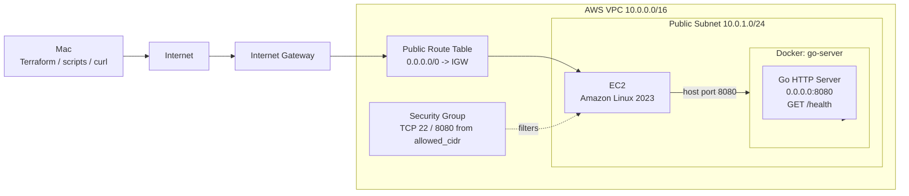

# Network Fault Observation

An AWS / Docker / Go experiment environment for observing and explaining **where communication stops during a network fault**.

## What This Project Does

The project builds and probes this request path:

```text
Mac -> Internet -> AWS VPC -> EC2 -> Docker -> Go Server
```

It changes one boundary through **Hypothesis -> Break -> Observe -> Explain -> Restore**. Evidence from multiple observation points separates an AWS network-path failure from an EC2 host, Docker, or application failure.

## Architecture



Terraform provisions one VPC, public subnet, Internet Gateway, route table, subnet association, security group, and EC2. The independent `aws_route.default` lets Experiment 1 change only that boundary. The Go 1.23 application runs as a non-root user in an Alpine 3.19 image built with Docker multi-stage builds.

## Experiment Result

Experiment 1 ran end-to-end on **2026-10-01** by temporarily removing:

```text
0.0.0.0/0 -> Internet Gateway
```

| Observation | Result |
|---|---|
| Baseline points | 5/5 successful |
| Mac curl | timeout / HTTP 000 / exit 28 |
| EC2 receives SYN | Yes — 5 packets |
| EC2 sends SYN-ACK | Yes — 10 packets including retransmissions |
| Client final ACK | No — 0 packets |
| EC2 internal health | 22/22 HTTP 200 |
| Docker | 22/22 `go-server Up` |
| Restore | HTTP 200 after 0 seconds |
| Terraform after restore | `No changes` |

Removing the Default Route did **not** prevent the inbound SYN from reaching the EC2 NIC. EC2 generated SYN-ACK responses, but the client returned no final ACK, so the TCP handshake did not complete and Mac curl timed out.

This partially falsified the original hypothesis. Mac curl failed as predicted, but EC2 did see the SYN and Go/Docker remained healthy. The failed boundary was the external return path, not the application.

## Observation Points

| Point | What it verifies |
|---|---|
| Mac curl | End-to-end reachability and HTTP response from outside AWS |
| EC2 NIC / tcpdump | TCP packets visible at the EC2 network interface |
| Docker | Whether `go-server` remains running |
| EC2 host curl | Reachability to `localhost:8080/health` |
| Go Server logs | Whether the request reached the application layer |

Requests use `X-Trace-ID`. Missing IDs are generated as UUID v4; supplied IDs must match `[A-Za-z0-9\-_]{1,64}`. The server echoes the ID in the response header and records it in structured logs.

tcpdump operates at TCP/L4 and cannot read HTTP Trace IDs. Packet evidence is correlated with curl and Go logs by timestamp, source address, and destination port 8080.

## Kiro University Features

### Spec

[Requirements](.kiro/specs/network-fault-observation/requirements.md), [Design](.kiro/specs/network-fault-observation/design.md), and [Tasks](.kiro/specs/network-fault-observation/tasks.md) define the experiment boundary, evidence schema, recovery requirements, and validation criteria.

### Steering

[`.kiro/steering/network-fault-observation.md`](.kiro/steering/network-fault-observation.md) uses `inclusion: auto` to provide the experiment model, Trace ID contract, observation points, and safety context.

### Property-Based Testing

[`app/main_test.go`](app/main_test.go) uses [`pgregory.net/rapid`](https://pkg.go.dev/pgregory.net/rapid) to verify that:

- valid 1–64 character Trace IDs round-trip unchanged;
- overlong or invalid-character IDs return HTTP 400;
- requests produce logs with required fields;
- missing IDs produce valid, unique generated IDs.

### Power and MCP

The [failure-investigation Power](.kiro/powers/failure-investigation/README.md) follows **Hypothesis -> Observe -> Evidence -> Root Cause -> Verify** and forbids automatic remediation, Terraform mutations, Docker stop/remove operations, and file writes. Its [MCP configuration](.kiro/powers/failure-investigation/mcp.json) starts AWS Documentation MCP as `aws-docs`; a project-level configuration also exists at [`.kiro/settings/mcp.json`](.kiro/settings/mcp.json).

### Custom Agent

[`.kiro/agents/incident-investigator.md`](.kiro/agents/incident-investigator.md) defines a read-only investigator using the Power and `aws-docs`. It separates hypotheses, observed facts, documentation evidence, inferences, and root-cause candidates while denying file, AWS, Terraform, and Docker mutations.

### Hook

[`.kiro/hooks/auto-validate.json`](.kiro/hooks/auto-validate.json) defines an enabled `AgentStop` hook that conditionally runs:

```text
cd app && go test ./...
cd infra && terraform fmt -check
cd infra && terraform validate
```

It validates only; it does not run `terraform fmt`, `apply`, or `destroy`.

## Project Structure

```text
.
├── app/                         # Go server, tests, Dockerfile
├── infra/                       # Terraform VPC, route, SG, EC2
├── scripts/                     # Baseline, observation, restore, compare
├── results/                     # Public JSON, logs, report; local pcap
├── Docs/                        # Notes and pre-experiment hypothesis
└── .kiro/
    ├── specs/network-fault-observation/
    ├── steering/
    ├── powers/failure-investigation/
    ├── agents/
    ├── hooks/
    └── settings/
```

## How to Run

### Prerequisites

- Terraform and an authenticated AWS CLI profile or session
- An EC2 key pair and readable private key
- A current public IPv4 CIDR for SSH and port 8080
- Local `bash`, `curl`, `jq`, `ssh`, `scp`, and `tcpdump`

Run the following from the repository root on **Mac**, except commands explicitly executed on EC2.

### 1. Provision AWS — Mac

Create `infra/terraform.tfvars` from the example and set `key_name` and `allowed_cidr`:

```hcl
region        = "ap-northeast-1"
instance_type = "t3.micro"
key_name      = "your-key-pair-name"
allowed_cidr  = "203.0.113.10/32"
```

```bash
terraform -chdir=infra init
terraform -chdir=infra plan -out=/tmp/network-fault-create.tfplan
terraform -chdir=infra apply /tmp/network-fault-create.tfplan

export EC2_PUBLIC_IP="$(terraform -chdir=infra output -raw ec2_public_ip)"
export EC2_KEY_PATH="/absolute/path/to/your-private-key"
```

### 2. Deploy the Go application — Mac to EC2

```bash
ssh -i "$EC2_KEY_PATH" "ec2-user@$EC2_PUBLIC_IP" \
  'mkdir -p ~/network-fault-observation'
scp -r -i "$EC2_KEY_PATH" app \
  "ec2-user@$EC2_PUBLIC_IP:~/network-fault-observation/"

ssh -i "$EC2_KEY_PATH" "ec2-user@$EC2_PUBLIC_IP" \
  'cd ~/network-fault-observation/app && \
   docker build -t network-fault-observation:experiment-1 . && \
   docker run --name go-server -d -p 8080:8080 \
     network-fault-observation:experiment-1'
```

### 3. Capture the baseline — Mac

```bash
./scripts/baseline.sh "$EC2_PUBLIC_IP" "$EC2_KEY_PATH"
```

### 4. Start fault monitoring — Mac to EC2

```bash
./scripts/pre-fault-monitor.sh "$EC2_PUBLIC_IP" "$EC2_KEY_PATH"
```

This starts tcpdump, localhost health checks, and `docker ps` collection before SSH may be lost.

### 5. Inject the fault — Mac

Temporarily remove only `aws_route.default` from `infra/main.tf`, then plan:

```bash
terraform -chdir=infra plan -out=/tmp/network-fault-delete-route.tfplan
```

Proceed only for `0 to add, 0 to change, 1 to destroy`, targeting only `aws_route.default`:

```bash
terraform -chdir=infra apply /tmp/network-fault-delete-route.tfplan
./scripts/observe.sh "$EC2_PUBLIC_IP"
```

### 6. Restore and collect — Mac

Restore the unchanged block and verify the plan contains only its addition:

```bash
terraform -chdir=infra plan -out=/tmp/network-fault-restore-route.tfplan
terraform -chdir=infra apply /tmp/network-fault-restore-route.tfplan

./scripts/post-restore-collect.sh "$EC2_PUBLIC_IP" "$EC2_KEY_PATH"
./scripts/restore_check.sh "$EC2_PUBLIC_IP"
./scripts/compare.sh
```

The collector stops PID-validated monitors and retrieves the pcap and logs. The restore check polls for HTTP 200 for up to 30 seconds; comparison generates `results/report.md`.

### 7. Cleanup — Mac

After preserving evidence, review and apply a full destroy plan:

```bash
terraform -chdir=infra plan -destroy -out=/tmp/network-fault-destroy.tfplan
terraform -chdir=infra apply /tmp/network-fault-destroy.tfplan
terraform -chdir=infra state list
```

The final command should return no resource addresses.

## Safety

- The fault is limited to the independent `aws_route.default` resource.
- The fault plan must contain exactly one deletion before apply.
- Monitoring starts before route removal because SSH may be lost.
- The Power and Custom Agent are read-only and do not remediate automatically.
- The Hook runs only `go test`, `terraform fmt -check`, and `terraform validate`.
- Terraform state is preserved through fault injection and restoration for clean teardown.
- The production run ended with `terraform destroy` and independent remaining-resource checks.

## Evidence

Evidence from the 2026-10-01 run is stored in the repository:

- [Pre-experiment hypothesis](Docs/experiment-1-hypothesis.md)
- [Baseline record](results/baseline.json)
- [Fault record](results/fault.json)
- Packet capture — collected and analyzed locally; excluded from Git by `*.pcap`
- [Internal health log](results/fault-health.log)
- [Docker status log](results/fault-docker.log)
- [Generated comparison report](results/report.md)

The report marks fault-phase `go_server_logs` as `not collected`: the request never completed the TCP handshake, and the collector gathers tcpdump, host health, and Docker state rather than a fault Trace ID application log.

## Cleanup Result

| Check | Result |
|---|---|
| Terraform destroy | 8 resources destroyed |
| Terraform state after destroy | Empty |
| VPC with the experiment name | None |
| Target EC2 in pending/running/stopping/stopped | None |
| Security Group with the experiment name | None |

## Lessons Learned

1. An AWS VPC Route Table and Linux `ip route` are different routing layers and must be observed separately.
2. Removing the IGW Default Route did not stop the external SYN from reaching the EC2 NIC; it prevented the TCP exchange from completing on the return path.
3. External reachability, container health, and application health need separate observation points. A failed curl did not mean Docker or the Go Server had failed.
